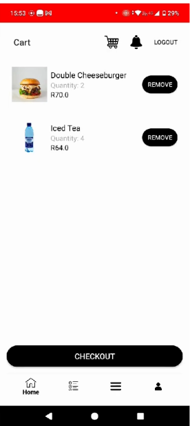
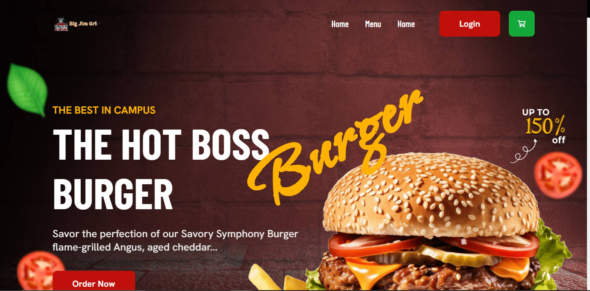
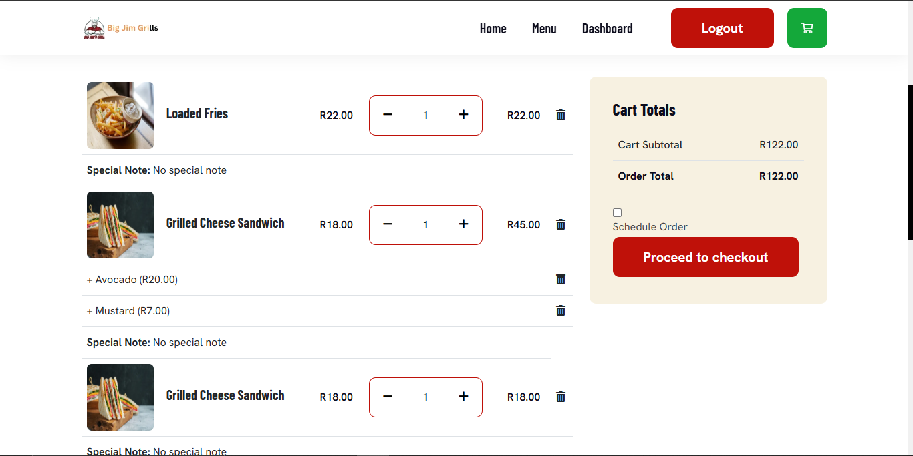
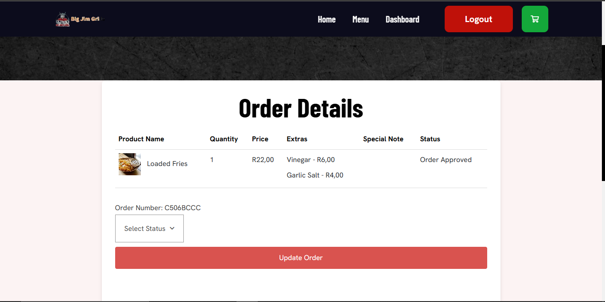
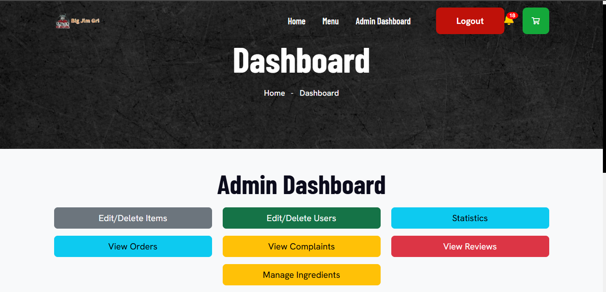
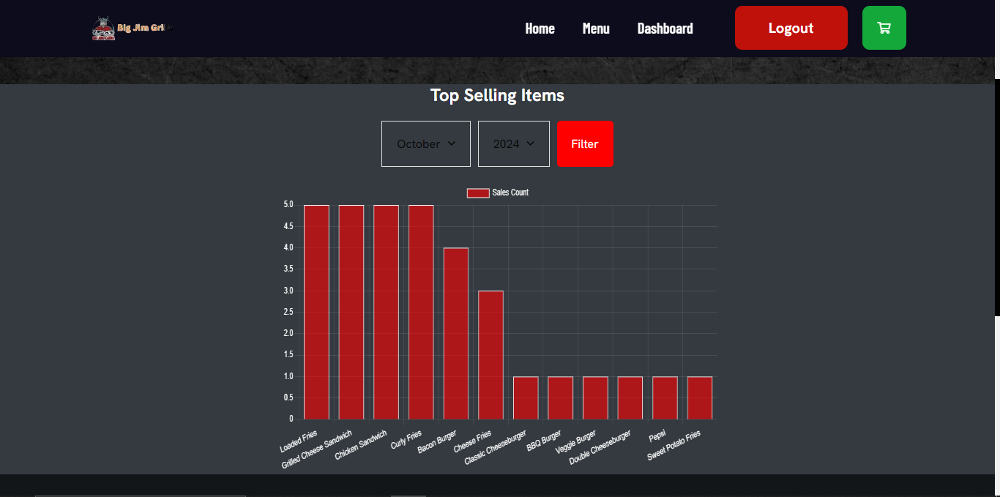

# Big Jim Grills

## 🚀 Overview

Big Jim Grills is a comprehensive e-commerce food ordering platform that combines a **mobile app** and a **web-based system** to deliver a seamless dining experience. Whether you're a customer placing an order or an admin managing the operations, our system is designed to cater to all your needs with efficiency and ease.

---

## 🎥 Demonstration Videos

- **Short Demo:** [Watch the Short Demo](#)  
- **Full Demo:** [Watch the Full Demonstration](#)

---

## 📱 Mobile App Features (Kotlin & Python Flask)

The mobile app offers a user-friendly interface to explore the menu, select special items, add them to your cart, and complete your order with a secure checkout that generates a receipt.

### **Key Features:**

- **Menu & Special Items:**  
  Browse an extensive list of food items, including daily specials.  
  

- **Add to Cart:**  
  Easily add your chosen items to the cart.  
  

- **Checkout & Receipt Generation:**  
  Complete your order and receive a receipt detailing your purchase.

---

## 💻 Customer Website Features (ASP.NET MVC)

Our customer website provides an enriched ordering experience with additional functionalities to manage your orders, provide feedback, and stay updated on your order status.

### **Key Features:**

- **Interactive Menu & Cart:**  
  Explore the menu and add items to your cart with ease.  
    
  

- **Order History:**  
  View your previous orders anytime.

- **Feedback & Complaints:**  
  Submit complaints or leave reviews if you’re not satisfied with your order.

- **Notifications & Receipts:**  
  Receive notifications when your order is ready and get your receipt emailed as a PDF.

---

## 🛠️ Admin Dashboard (ASP.NET MVC)

The admin dashboard is built to ensure smooth operations, from managing orders to analyzing sales data, empowering you to make data-driven business decisions.

### **Key Features:**

- **Order Management:**  
  View all incoming orders and update their statuses to notify customers when ready.  
  

- **Complaints & Reviews:**  
  Monitor and respond to customer feedback and complaints.

- **Inventory Management:**  
  Keep track of stock levels and manage inventory efficiently.

- **Business Insights:**  
  Analyze sales data and view detailed statistics to inform better business decisions.  
    
  

---

## 🔧 Tech Stack

- **Mobile App:** Kotlin, Python (Flask)
- **Customer Website:** ASP.NET MVC
- **Admin Dashboard:** ASP.NET MVC

---

## 📜 License

This project is proprietary. All rights are reserved. No modifications, redistribution, or commercial use is permitted without prior authorization from the project owner.
